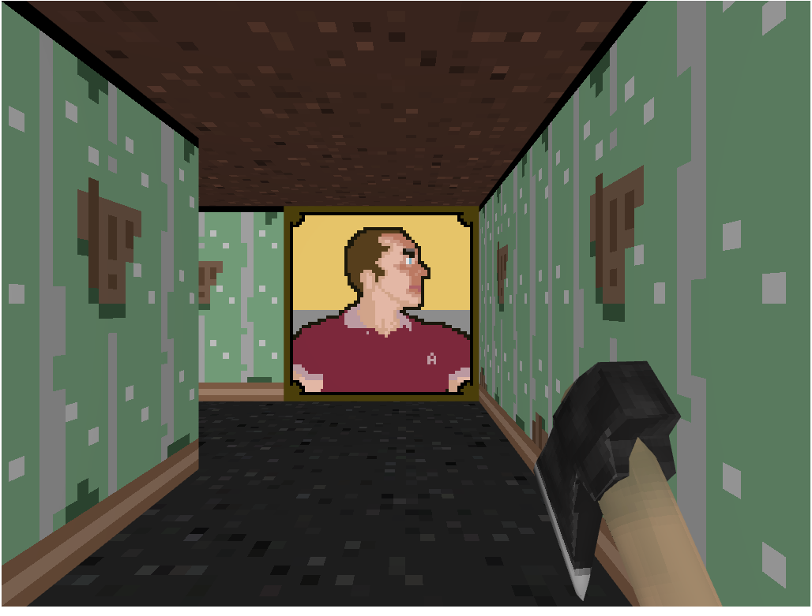

#The Mansion of Dr Anton#

This is the source code for the WebGL 3d game I have on my website:
[antongerdelan.net/dungeo](http://antongerdelan.net/dungeo/)

I made it on a sick day when feeling delirious, and added bits and pieces over
the next few eves. It was going to be a dungeon explorer but it just turned
into a mash-up of games I had in the '90s; Wolfenstein 3-D, Dangerous Dave in
the Haunted Mansion, Nightmare 3-D, Ken's Labyrinth.

##Features##

* awesome low-level WebGL hardware-accelerated 3d browser graphics in retro style
* directional shading (instead of Phong etc.)
* diminished lighting
* manual gamma correction
* sort transparent items before draw
* image-based map format w/canvas2d
* actor/map collision detection
* rudimentary AI
* cheap visibility culling
* fake framebuffer post-processing fx
* shooting hit detection with point vs. line distance check
* handsomest game boss ever

##Sound Attrib##

* toccata - wikipedia
